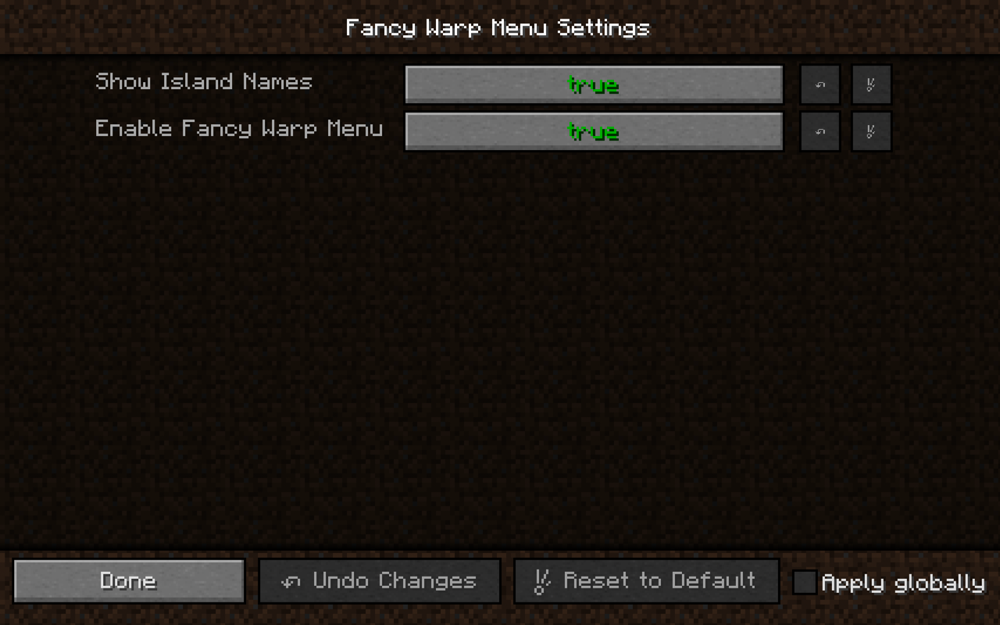

# Fancy Warp Menu

A prettier warp menu for Hypixel SkyBlock

-----

This is a recreation of the fancy warp menu from SkyblockAddons, rewritten for better performance.

## Features

- Built for Forge for Minecraft 1.8.9
  - Fabric 1.20.1 port planned
- Lightweight
  - Just the warp menu, no additional features
- Supports custom layouts
  - Learn to make one [here](https://github.com/ILikePlayingGames/FancyWarpPackTemplate)!

## Screenshots

Large GUI scale

Normal GUI scale

Settings (access by clicking the portal in the bottom right corner)

## Supported Languages

Help us translate the mod on [Crowdin](https://crowdin.com/project/fancy-warp-menu)!
- English (US)
- Chinese Simplified

## Support

Please join my [Discord server](https://discord.gg/tXFf9umfA9) for support.

## Credits

Mod template: [Nea's Forge 1.8.9 Template](https://github.com/romangraef/Forge1.8.9Template)
 
Portal texture: [SkyblockAddons](https://github.com/BiscuitDevelopment/SkyblockAddons/blob/main/src/main/resources/assets/skyblockaddons/portal.png)
 
Island Renders: Rendered by Schlaumeyer using [Blender](https://www.blender.org/)
 
Translators:
- PumpkinXD
- Rodry

## Licenses

View the list [here](https://github.com/ILikePlayingGames/FancyWarpMenu/wiki/Licenses).