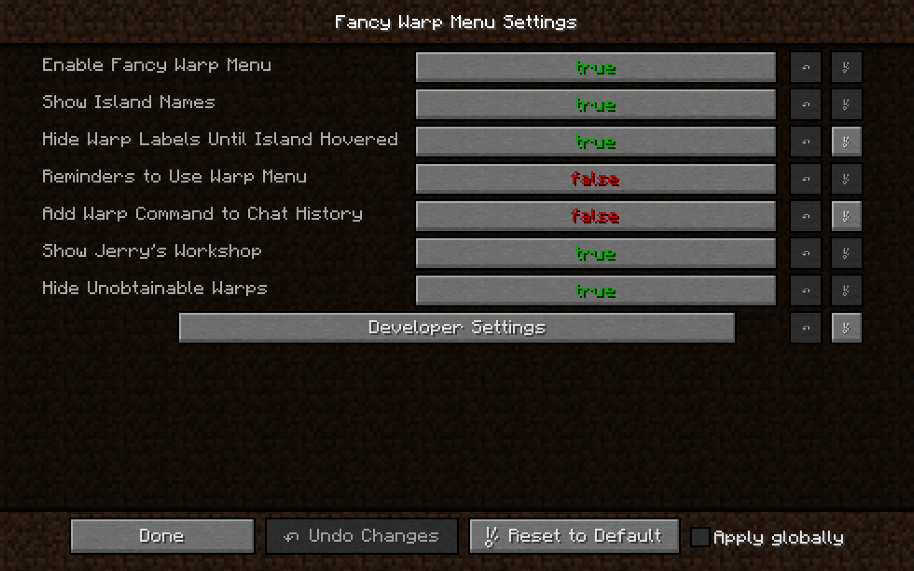

# Fancy Warp Menu

A prettier warp menu for Hypixel SkyBlock

-----

This is a recreation of the fancy warp menu from SkyblockAddons, rewritten for better performance.

# Screenshots

Large GUI scale

Normal GUI scale

Settings (access via pause > mod options > fancy warp menu > config)

# Credits

Mod template: [Nea's Forge 1.8.9 Template](https://github.com/romangraef/Forge1.8.9Template)
 
Portal texture: [SkyblockAddons](https://github.com/BiscuitDevelopment/SkyblockAddons/blob/main/src/main/resources/assets/skyblockaddons/portal.png)
 
Island Renders: Rendered by Schlaumeyer using [Chunky](https://github.com/chunky-dev/chunky)

# Licenses

View the list [here](https://github.com/ILikePlayingGames/FancyWarpMenu/wiki/Licenses).